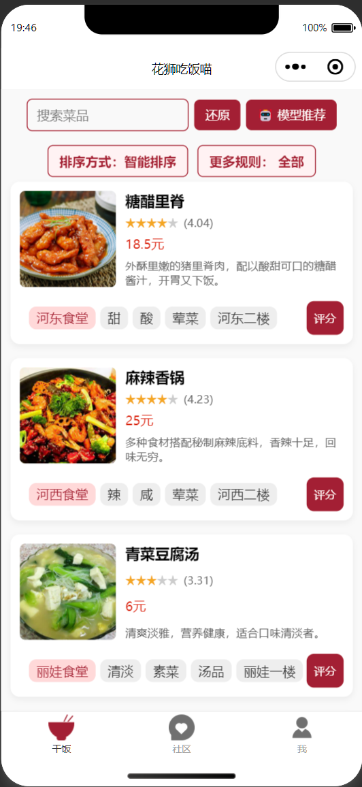
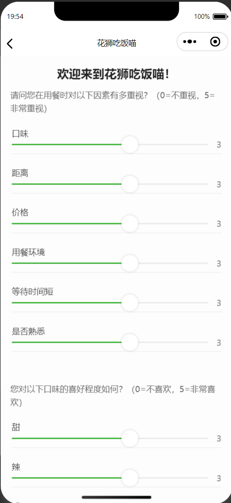
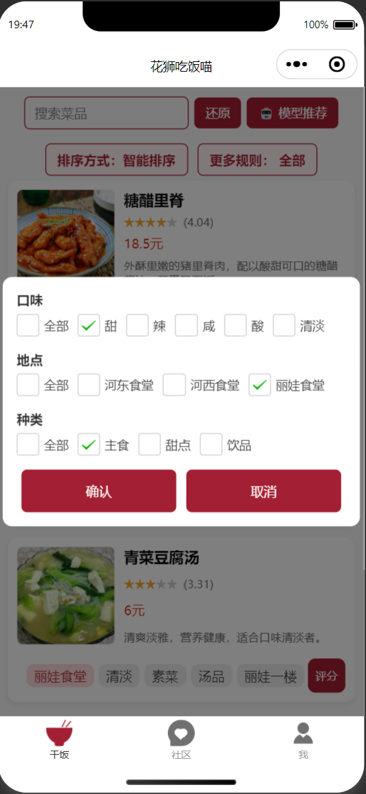
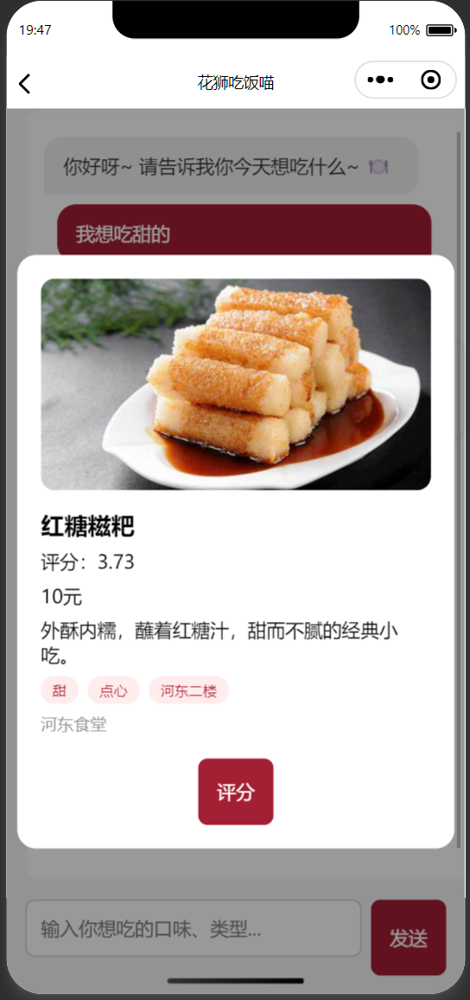
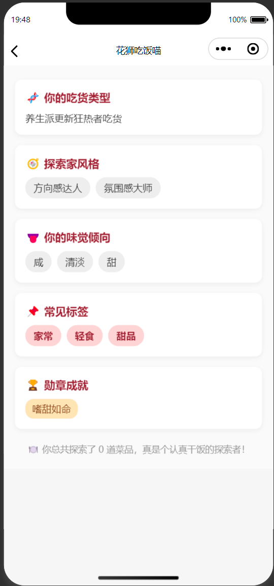

# 花狮干饭喵

## 项目概述

《花狮干饭喵》是一款智能点菜小程序，旨在为大学校园提供便捷的点菜服务。通过智能推荐、社区互动、个性化设置等功能，为用户提供更加高效、个性化的点餐体验。用户可以根据自己的口味偏好与餐厅距离等因素，快速选择符合需求的菜品，并与其他用户分享餐饮体验。

本小程序结合了**人机交互设计**（HCI）的核心原则，确保系统界面简洁、操作流畅、用户体验友好，提供了多个交互入口如“点菜”、“社区”和“我”，并支持首次登录问卷填写、推荐系统定制、菜品筛选等功能。



---

## 主要功能

1. **首次登录逻辑**：

   * 提示用户登录，若为新用户则展示问卷，收集用户的口味偏好与重视因素（如距离、口碑等）。
  
  

2. **主页面**：

   * 包括一个搜索框与推荐系统，支持“智能排序”、“位置优先”与“评分优先”功能。
   * 模型推荐页：基于用户的输入与偏好，返回个性化的菜品推荐。





3. **社区页面**：

   * 用户可在此发布与浏览食评帖子，支持点赞、评论等社交功能。
   


4. **个人页面（“我”）**：

   * 显示用户的头像、昵称。
   * 提供可重复填写的问卷，生成趣味报告并支持分享。

   

5. **语言切换**：

   * 支持中英文语言切换，提供更多用户群体的服务。

    

---

## 安装步骤

1. **克隆项目**：

   ```bash
   git clone https://github.com/xiwwix/ECNU-Dishcovery.git
   ```

2. **安装依赖**：

   * 确保安装了微信开发者工具，打开项目所在文件夹。
   * 安装所需的前端依赖：`npm install`。

3. **启动小程序**：

   * 在微信开发者工具中打开项目，选择模拟器运行，开始开发与调试。

---

## 技术栈

* **前端**：微信小程序框架
* **推荐系统**：基于大模型API实现的智能推荐系统
* **数据库**：微信云开发（云函数、数据库管理）
* **语言切换**：多语言支持（中文、英文）
* **交互设计**：符合HCI原则，用户体验为核心

---


如有任何问题或建议，欢迎通过 Issue 或 Pull Request 提交您的反馈，感谢您的参与！
